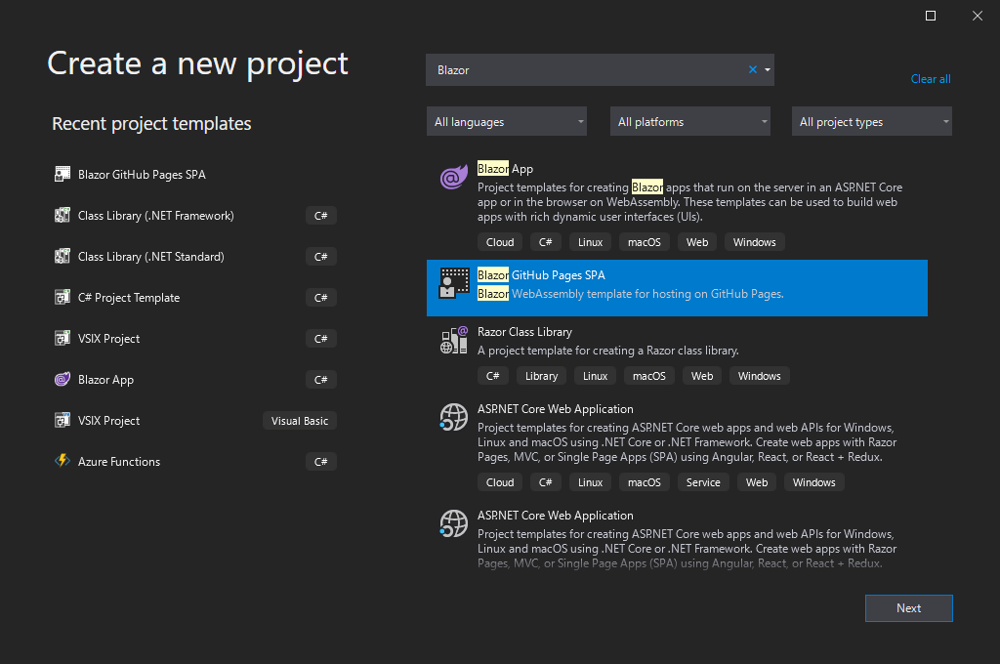
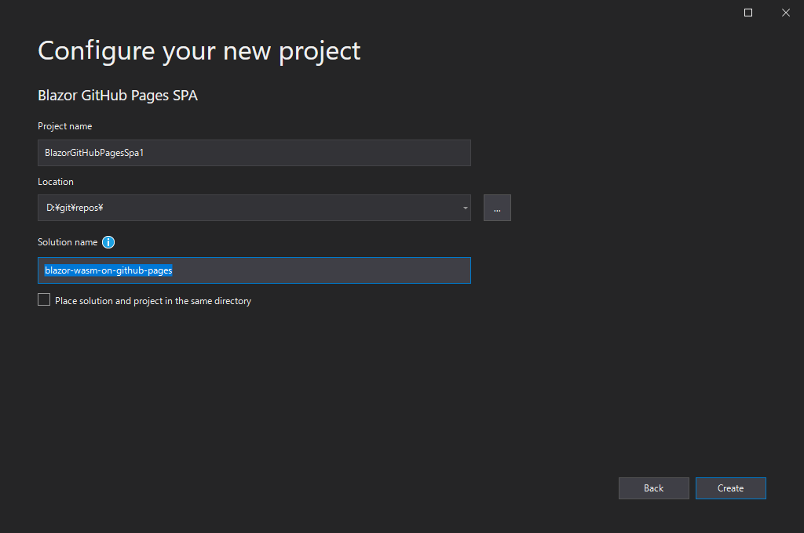
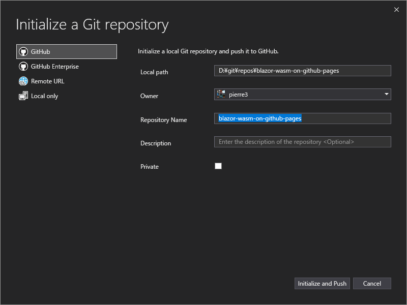
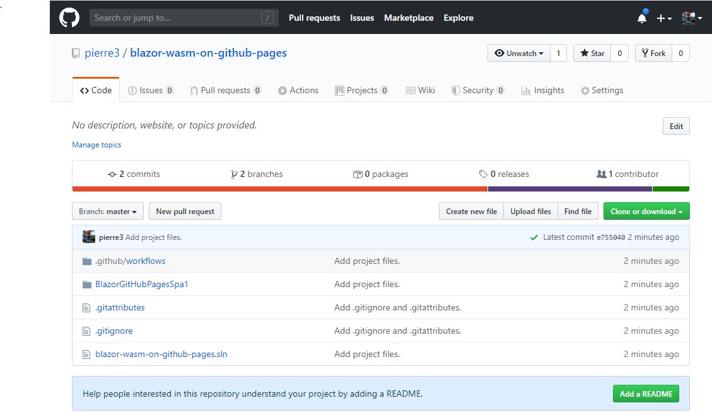
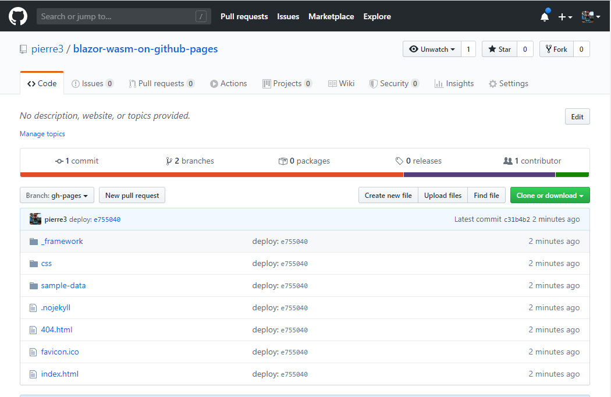
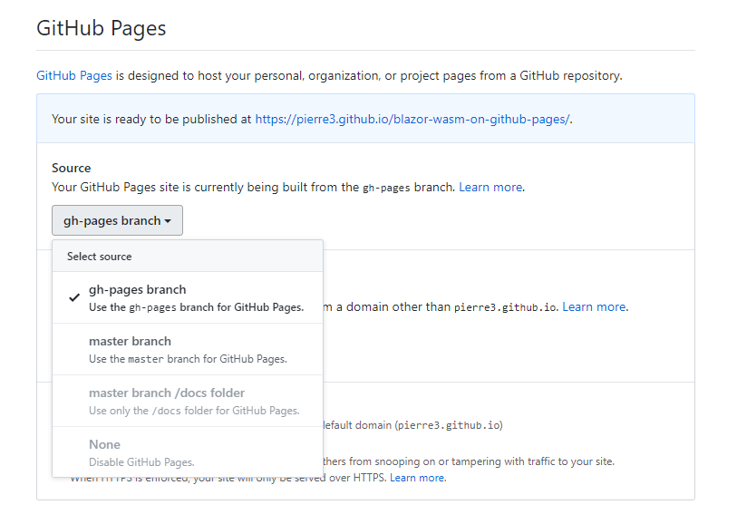
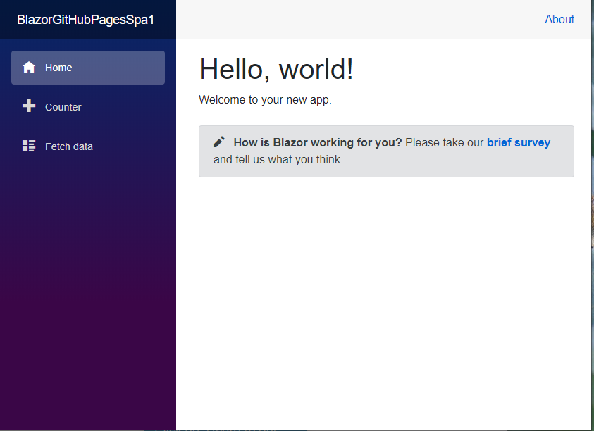

# Blazor WASM GitHub Pages Template
A Blazor WebAssembly template for hosting on GitHub Pages.

This template works in the following environment.
- [Visual Studio 2019 Preview](https://dotnet.microsoft.com/download/dotnet-core/3.1)
- [.NET Core 3.1 SDK](https://visualstudio.microsoft.com/vs/preview/)

The version of Blazor used in this template is `Blazor WebAssembly 3.2.0 RC1`. 

## Over View
This is a project template that adds the following changes to the official Blazor WebAssembly template.

- Add the scripts needed to run a single-page application on a static site based on the methodology described in [here](https://github.com/rafrex/spa-github-pages)

  - Add a custom 404.html page that rewrites the URL and redirects it to index.html
  - Add a script to index.html to handle routing
- Change the path base to the path to the GitHub project page
  - `<base href="/my-repository-name/" />`
- Added GitHub action to build pushed source code in Master branch and deploy it to `gh-pages` branch

## Installation
Download the VSIX installer from the Visual Studio Marketplace or use the Manage extensions dialog box in Visual Studio to install it.

- [Blazor GitHub Pages SPA - Visual Studio Marketplace](https://marketplace.visualstudio.com/items?itemName=pierre3.BlazorWASMGitHubPages)

- [Find and install extensions - Visual Studio](https://docs.microsoft.com/en-us/visualstudio/ide/finding-and-using-visual-studio-extensions?view=vs-2019)

## Usage

1. Launch the Visual Studio 2019 Preview and select "Create a New Project".

2. Select "Blazor GitHub Pages SPA" from the list of projects and click on the "Next" button. 

3. "Configure your new project" dialog, enter "project name" and "solution name" and click the "Create" button.
    - In the solution name, enter the name of the repository you want to create on GitHub.

4. Once the project you created is loaded, select "Add to Source Control" from the "File" menu.

5. In the "Initialize Git repository" dialog, select "GitHub" and enter "Solution Name" in the "Repository Name" field.

6. When you click the "Initialize and Push" button, a repository is created on GitHub and the source code is pushed to the Master branch.

7. When you push your code to the master branch, GitHub Actions executes the build and pushes the build artifact to the "gh-pages" branch.

8. On your GitHub repository page, click on the Settings tab and check the GitHub Page section.

9. After selecting "master branch" in the "Source" field pull-down, select "gh-pages branch" again.

10. When you see "Your site is published at {URL}", click on the URL. This should take you to the Blazor Webassembly site you just created. (It will take a little while for the page to become accessible.)

